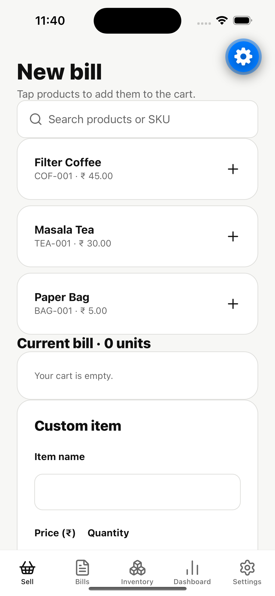
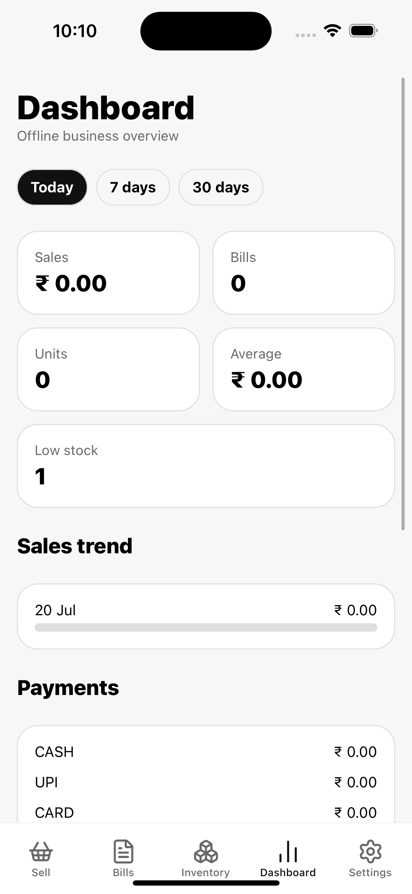
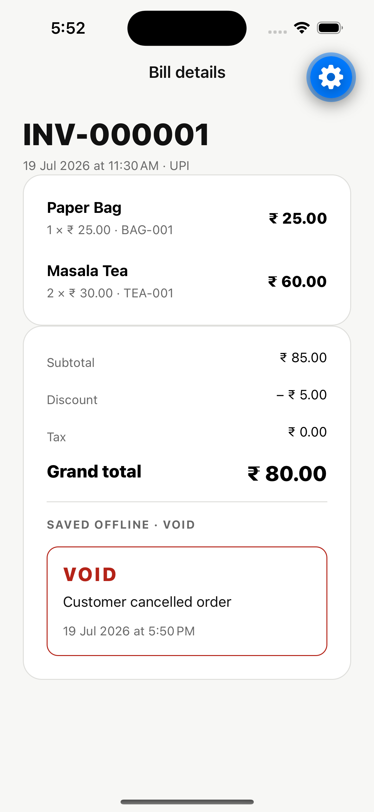
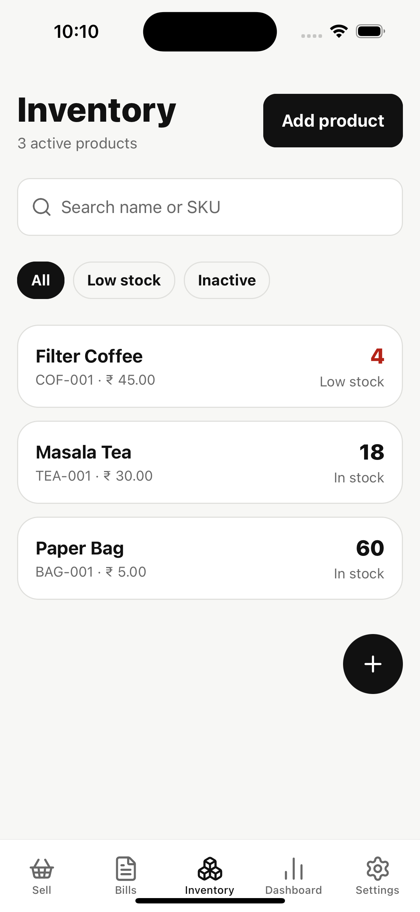
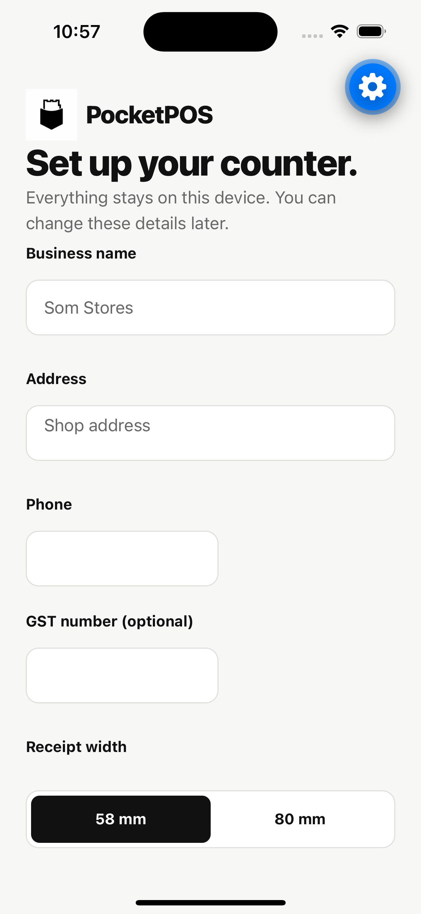
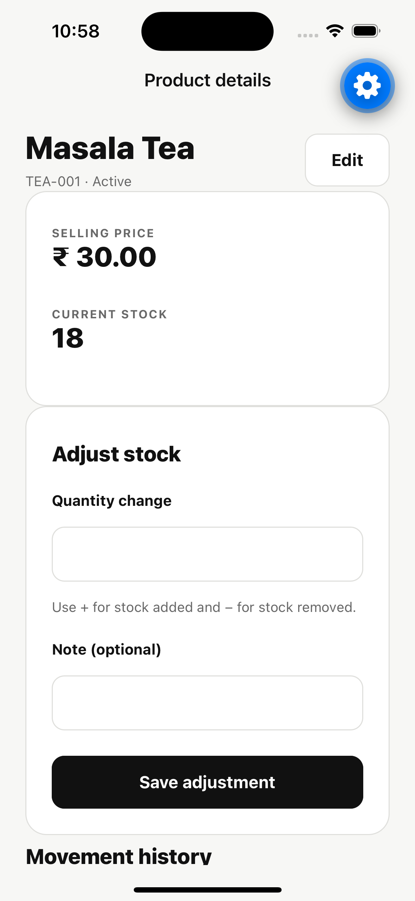
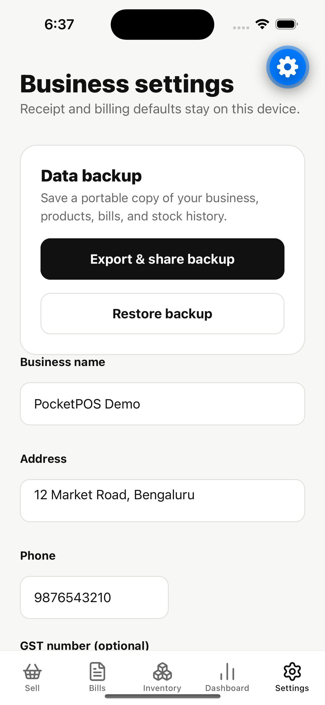

# PocketPOS

PocketPOS is a practical offline-first billing and inventory app for small businesses. It combines local business setup, product and stock management, fast checkout, and bill history in one monochrome mobile workflow.


## Built with


## Features

- First-run business and receipt setup
- Five-tab phone/tablet navigation
- Product creation, editing, search, and enable/disable workflow
- Opening stock and manual stock adjustments
- Auditable inventory movement history
- Low-stock filters and warnings
- Integer-paise currency calculations
- Product search, cart quantities, and custom line items
- Fixed or percentage discounts and cash, UPI, card, or other payments
- Atomic offline checkout with stock validation and automatic inventory deduction
- Sequential invoice numbers, bill history, and completed bill details
- Monochrome 58 mm and 80 mm thermal receipt rendering
- System receipt printing plus locally generated, shareable bill PDFs
- Offline Today, 7-day, and 30-day sales analytics with native charts
- Payment totals, top products, recent bills, and low-stock dashboard summaries
- Auditable bill voiding with transactional stock restoration
- Versioned JSON backup, native sharing, validation, and atomic full restore
- Local SQLite source of truth with transactional, versioned migrations
- Development-only idempotent demo data
- Android development, preview, and release APK profiles

Direct ESC/POS printer integration is intentionally reserved for a later phase; PocketPOS currently prints through the device system print sheet.

## Requirements

- Node.js 20+
- pnpm 10+
- Android Studio and an Android emulator, or an Android device with Expo Go
- An Expo account only when creating cloud APK builds

## Run locally

```bash
pnpm install
pnpm start
```

Press `a` to open Android, or scan the QR code with Expo Go. PocketPOS does not need internet after the development bundle is loaded.

Useful checks:

```bash
pnpm test
pnpm typecheck
pnpm lint
pnpm export
```

## Project structure

```text
app/                         Expo Router routes
src/components/              shared monochrome UI and branding
src/db/                      SQLite setup, migrations, repositories
src/features/setup/          business setup and validation
src/features/inventory/      product and stock workflows
src/features/billing/        cart, checkout, and bill history
src/features/analytics/      offline dashboard queries and UI
src/types/                   domain models
src/utils/                   currency, dates, IDs, stock rules
docs/                        architecture and APK guides
```

Database queries stay inside repositories. Screen components use repository methods and never issue SQL directly.

## Offline guarantees

Business details, products, stock quantities, movement history, and completed bills are stored in `pocketpos.db`. Checkout validates stock and saves the invoice, item snapshots, stock deductions, and movement records in one transaction. Installing a newer APK with the same Android package name and signing key preserves the database while migrations apply incrementally.

## Android builds

See [APK_BUILD.md](docs/APK_BUILD.md) for development and release APK instructions. Data transfer and recovery are covered in [BACKUP_RESTORE.md](docs/BACKUP_RESTORE.md), and architecture details are in [ARCHITECTURE.md](docs/ARCHITECTURE.md).

## Screenshots

Captured from PocketPOS running locally on an iPhone 15 simulator with offline demo data.

| Sell                                                                                | Dashboard                                                                                        | Voided bill                                                                                        |
| ----------------------------------------------------------------------------------- | ------------------------------------------------------------------------------------------------ | -------------------------------------------------------------------------------------------------- |
|  |  |  |

| Inventory                                                                                    | Setup                                                                               | Product detail                                                                                     |
| -------------------------------------------------------------------------------------------- | ----------------------------------------------------------------------------------- | -------------------------------------------------------------------------------------------------- |
|  |  |  |

| Data backup                                                                                                  |
| ------------------------------------------------------------------------------------------------------------ |
|  |

The [launch screen](docs/screenshots/splash.png) and full capture notes are available in [docs/screenshots](docs/screenshots/README.md).
